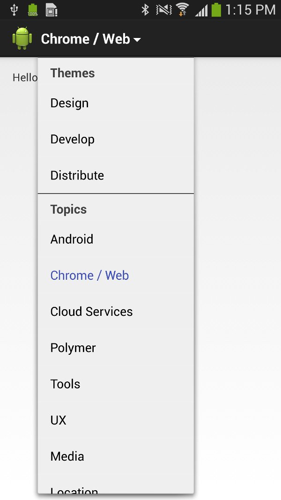
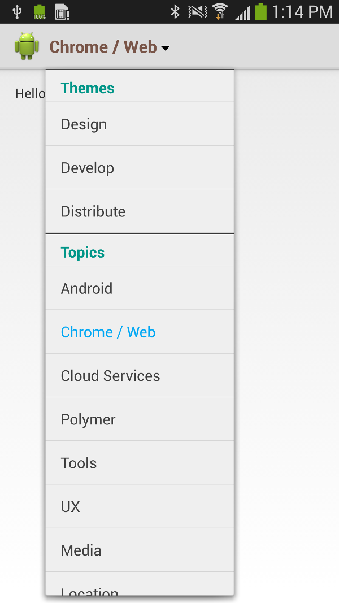

<h1>SectionedActionBarList</h1>
<hr/>

This Android library allows you to replace the drop down navigation list when the items in the list are needed to be grouped by sections. It was inspired from the Google I/O 2014 app how sessions are grouped in the ActionBar list. 



<h3>Example</h3>
The default usage looks like this:
```java
List<Section> sections = new ArrayList<Section>();

Section themes = new Section("Themes");
themes.add("Design");
themes.add("Develop");
themes.add("Distribute");
sections.add(themes);

Section topics = new Section("Topics");
topics.add("Android");
topics.add("Chrome / Web");
topics.add("Cloud Services");
topics.add("Media");
topics.add("Location");
topics.add("Performance");
sections.add(topics);

Section types = new Section("Types");
types.add("Sessions");
types.add("App Reviews");
types.add("Box Talks");
sections.add(topics);

SectionedActionBarSpinner actionBarSpinner = new SectionedActionBarSpinner(this).from(sections);
actionBarSpinner.setItemSelectedListener(new ItemSelectedListener() {
  @Override
  public void onItemSelected(AdapterView<?> parent, View view, int position, long id, String sectionName, String itemName) {
      Toast.makeText(MainActivity.this, "Section: " + sectionName + ", Item: " + itemName, Toast.LENGTH_LONG).show();
  }
});
```
<h3>Configuration</h3>
Small customizations can be done to fit with your application design:
```java
SpinnerConfiguration configuration = new SpinnerConfiguration(this);
configuration.setActionBarItemColorResource(R.color.brown);
configuration.setIndicatorDrawableResource(R.drawable.spinner_indicator_dark);
configuration.setSectionTitleColorResource(R.color.teal);
configuration.setDropdownItemColorResources(R.color.light_blue, R.color.dark_grey);

SectionedActionBarSpinner actionBarSpinner = new SectionedActionBarSpinner(this, configuration).from(sections);
// ....
```

